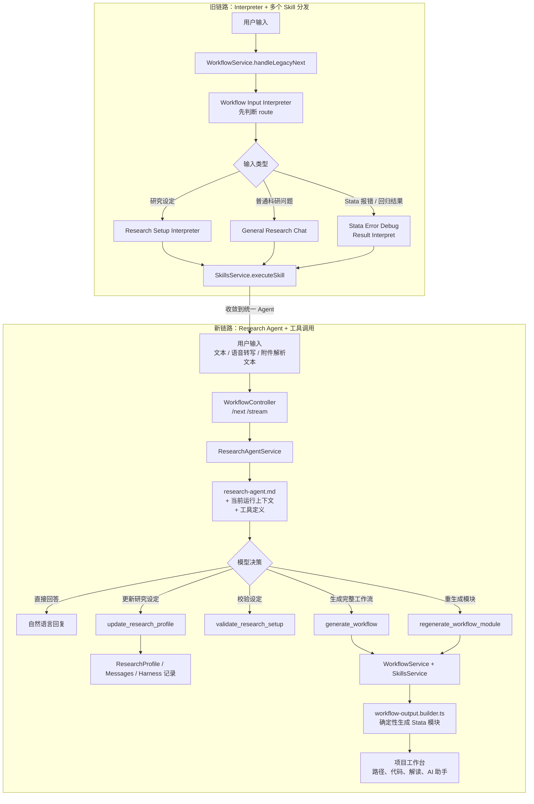
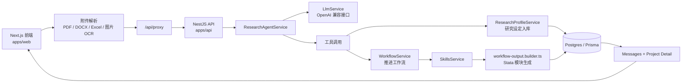
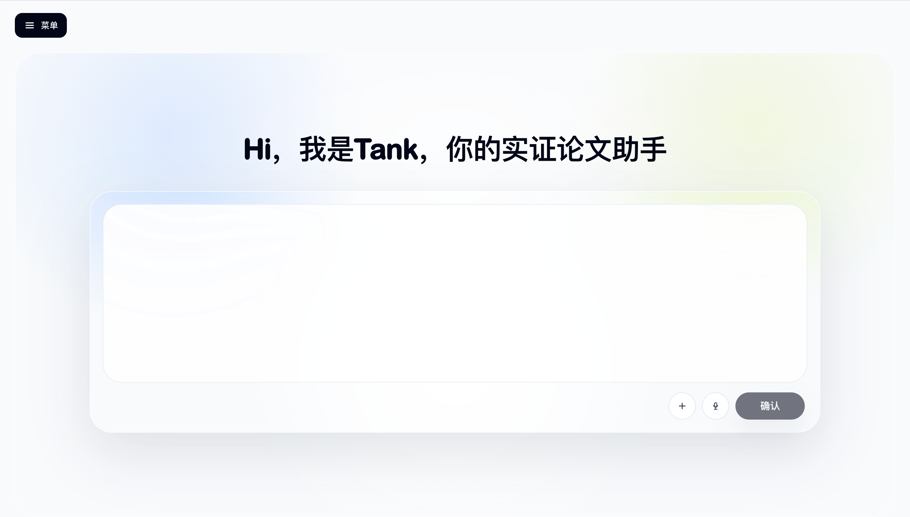
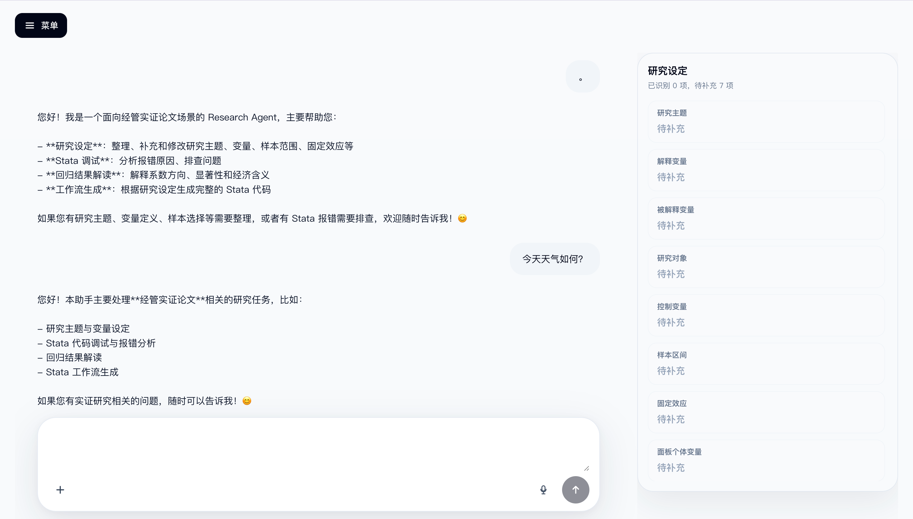
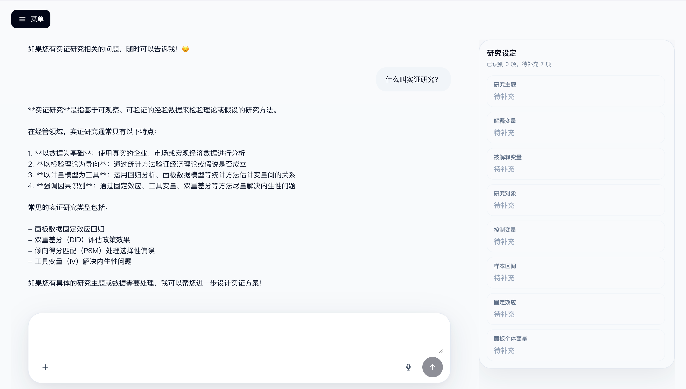
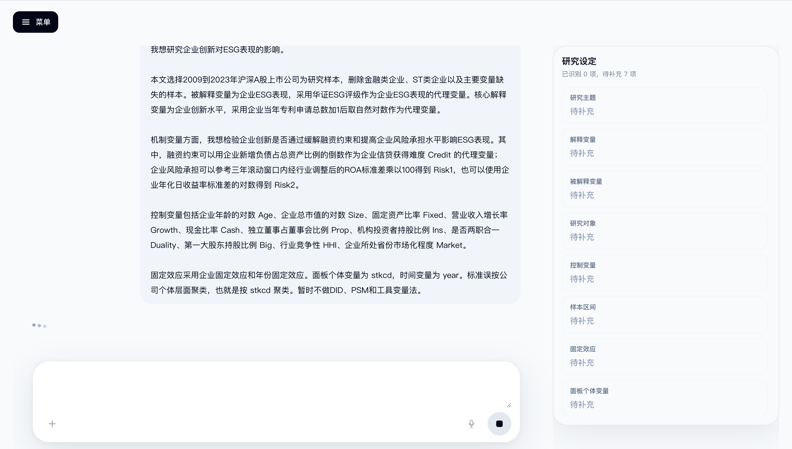
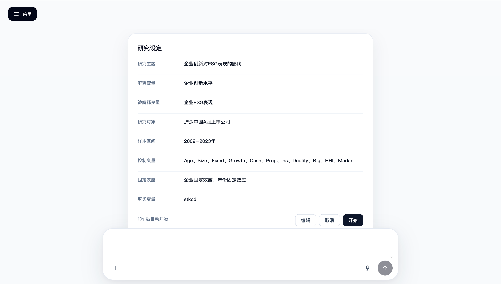
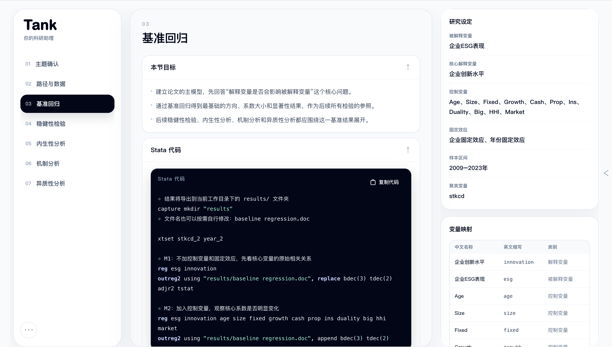
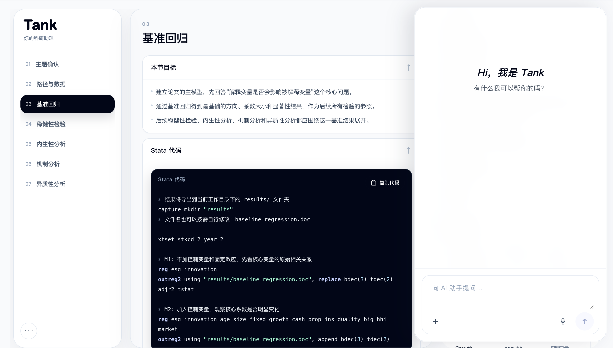

# 经管实证论文 AI Agent

一个面向经管 / 管理 / 金融实证论文场景的 AI 工作台。用户可以输入研究主题、变量设定、开题报告片段、数据字典或 Stata 问题，系统会先整理成结构化研究设定，再生成可阅读、可复制、可继续追问的 Stata 工作流。

当前版本的重点迭代是：从“多个 Skill 先分类再分发”的旧链路，收敛到“一个 Research Agent 统一理解用户输入，并通过工具更新项目状态或生成工作流”的新链路。

## 架构迭代



## 项目做了什么

- **研究设定抽取**：从自然语言、开题报告、数据字典、截图 OCR 等输入中抽取研究主题、解释变量、被解释变量、研究对象、控制变量、样本区间、固定效应、面板字段和聚类变量。
- **统一 Agent 调度**：`research-agent.md` 负责判断用户是在闲聊、问科研问题、补充研究设定、要求生成工作流，还是要求重生成某个模块。
- **可追踪工作流**：每次对话都会创建 `AgentRun`，并记录事件、工具结果、进度和错误，方便调试和展示 Agent 执行过程。
- **确定性 Stata 生成**：主工作流的 Stata 代码由后端模板确定性生成，减少模型随机性，保证同一研究设定下输出更稳定。
- **工作台式 UI**：前端把论文流程拆成主题确认、路径与数据、基准回归、稳健性、内生性、机制、异质性等模块，并支持右侧 AI 助手继续追问。

## 当前主链路



## 截图

### 首页输入框

用户进入产品后首先看到的界面，支持文本输入、附件上传（PDF / DOCX / Excel / 图片）和语音输入，Agent 会自动识别输入内容并进入对应的处理流程。



### 闲聊场景

当用户输入与科研无关的内容时，Agent 会礼貌地引导用户回到经管实证论文的研究任务上，并提示当前可处理的科研场景。



### 科研问答场景

用户可以直接向 Agent 提问科研概念性问题，例如固定效应、DID、PSM、工具变量或 Stata 语法等，Agent 会直接给出专业解答，无需进入工作流生成流程。



### 研究设定思考过程

用户输入完整的研究需求后，Agent 会在对话中展示思考和理解过程，从自然语言描述中逐步抽取研究主题、变量设定、样本区间等关键信息。右侧「研究设定」面板实时显示已识别和待补充的字段。



### 研究设定卡片

当 Agent 完成研究设定的抽取后，会弹出结构化的研究设定卡片，汇总展示研究主题、解释变量、被解释变量、研究对象、控制变量、固定效应等全部信息。用户可以点击「编辑」微调，或直接「开始」生成完整 Stata 工作流。



### 工作流页面

确认研究设定后，系统会生成一套完整的 Stata 工作流，按「主题确认 → 路径与数据 → 基准回归 → 稳健性检验 → 内生性分析 → 机制分析 → 异质性分析」组织为 7 个模块。每个模块展示本节目标、可复制的 Stata 代码，以及右侧的研究设定和变量映射面板。



### 右侧 AI 助手

在工作流的任意模块中，用户都可以打开右侧的 AI 助手面板，针对当前模块的代码或研究思路继续追问、要求修改、补充分析或重新生成，实现工作台内的持续交互。



## 技术栈

- **Frontend**：Next.js 15, React 19, Tailwind CSS
- **Backend**：NestJS, Prisma, PostgreSQL
- **AI**：OpenAI-compatible Chat Completions API, tool calling
- **Monorepo**：pnpm workspace
- **Prompt 管理**：`packages/prompts`
- **共享类型**：`packages/shared`

## 代码结构

```text
apps/
  web/                       Next.js 前端
  api/                       NestJS 后端 API
packages/
  prompts/                   系统 prompt、Research Agent prompt、Skill prompt manifest
  shared/                    前后端共享枚举、schema 和 API 类型
apps/api/src/modules/
  agent/                     当前主 Agent 调度逻辑
  workflow/                  工作流推进与批量生成
  skills/                    Skill registry、执行器、确定性 Stata 输出模板
  research-profile/          研究设定、变量映射和数据字典处理
  harness/                   Agent run、事件、工具结果和 artifact 记录
```

## Prompt 资产

当前主链路最关键的是：

- `packages/prompts/agent/research-agent.md`：Research Agent 的主行为准则，决定直接回答还是调用工具。
- `packages/prompts/common/system.md`：Skill 调用时的通用系统约束。
- `packages/prompts/src/index.ts`：prompt manifest，运行时通过它找到具体 markdown 文件。

部分旧 Skill prompt 仍保留，用于兼容、测试和直接调用，例如：

- `packages/prompts/skills/workflow-input-interpreter/template.md`
- `packages/prompts/skills/general-research-chat/template.md`
- `packages/prompts/skills/result-interpret/template.md`
- `packages/prompts/skills/stata-error-debug/template.md`

## 本地运行

安装依赖：

```bash
corepack pnpm install
```

配置后端环境变量：

```bash
cp apps/api/.env.example apps/api/.env
```

至少需要：

```env
DATABASE_URL="postgresql://..."
OPENAI_API_KEY="..."
OPENAI_BASE_URL="https://api.openai.com/v1"
OPENAI_MODEL="gpt-4.1-mini"
```

初始化 Prisma：

```bash
corepack pnpm --filter api prisma:generate
corepack pnpm --filter api prisma:migrate
```

启动后端：

```bash
corepack pnpm --filter api start:dev
```

启动前端：

```bash
corepack pnpm --filter web dev
```

如果本地 `3000` 端口已被占用，可以改用：

```bash
cd apps/web
./node_modules/.bin/next dev -p 3001
```

默认本地地址：

- Frontend: `http://localhost:3000`
- API: `http://localhost:4000/api`

前端通过 `apps/web/app/api/proxy/[...path]/route.ts` 代理到后端。未来部署时可设置 `API_BASE_URL` 或 `NEXT_PUBLIC_API_BASE_URL`。

## 当前状态

- GitHub `main` 是当前前端部署来源。
- Vercel 前端部署使用 `apps/web` 作为 root directory。
- Railway 后端自动部署已停用；后端目前按本地或未来自定义托管方式运行。
